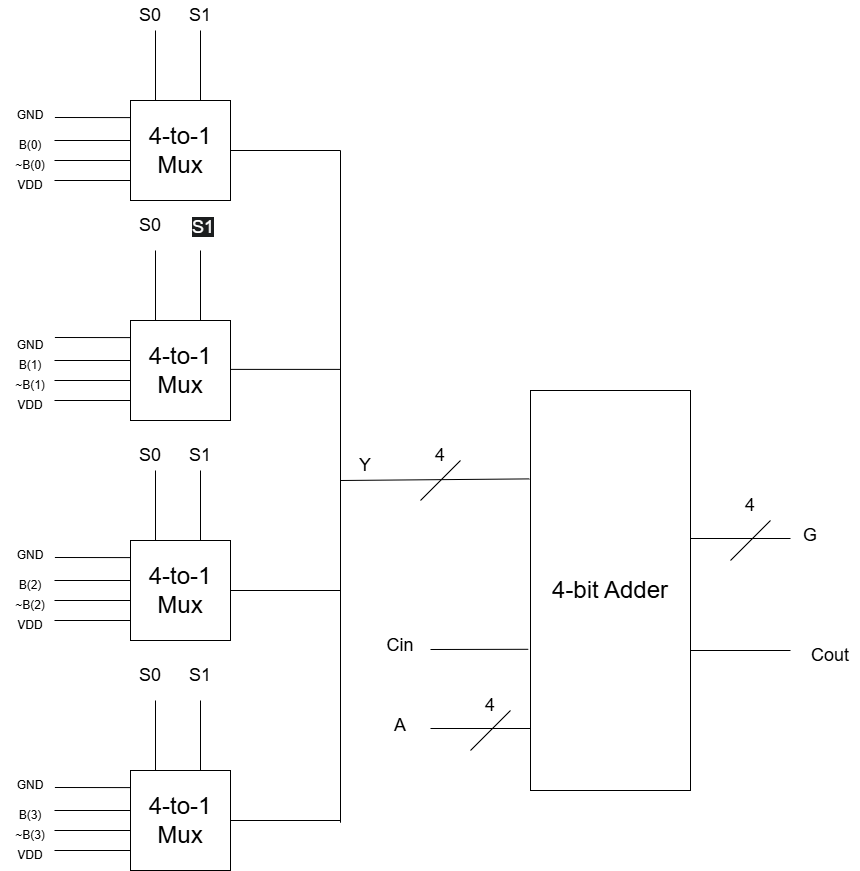

# VHDL-8-function-4-bit-ALU
This project implements an 8 function, 4 bit ALU using structural VHDL code. 

The functions of the ALU are shown in the table below

| S1 | S0 | Cin | Function |
|----|----|-----|----------|
| 0 | 0 | 0 | Transfer A |
| 0 | 0 | 1 | A + 1 |
| 0 | 1 | 0 | A + B |
| 0 | 1 | 1 | A + B + 1 |
| 1 | 0 | 0 | A + ~B |
| 1 | 0 | 1 | A - B |
| 1 | 1 | 0 | A - 1 |
| 1 | 1 | 1 | Transfer A |

A bottom-up approach was used when designing this ALU, starting at the gate entities and working up to the top level alu\_4 entity.

